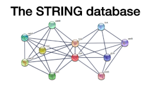
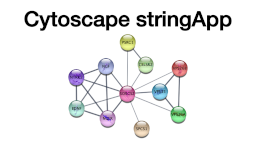

## Recommended resources

### Computational proteomics

Online lecture on computational proteomics [here](http://training.bmb.sdu.dk/courses/course-v1:University_of_Southern_Denmark+SDU_BMB_COMPPROT+2020_1/about).

### Biological networks & enrichment

[Here](https://www.youtube.com/playlist?list=PLjnQS7gxY4AqVfFw5n5N7pVQBUy9eMWuM) is a YouTube playlist with videos created by Lars Juhl Jensen to cover some basic concepts and topics in network biology.

There are also a few tool-specific videos here: 

You can find more similar lecture on [this YouTube channel](https://www.youtube.com/c/larsjuhljensen).

