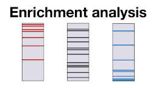

## Recommended resources

### Computational proteomics

Online lecture on computational proteomics [here](http://training.bmb.sdu.dk/courses/course-v1:University_of_Southern_Denmark+SDU_BMB_COMPPROT+2020_1/about).

### Biological networks & enrichment

