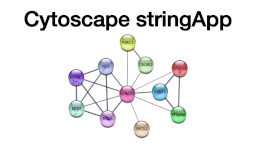

## From quantitatives to biological insights

### What we need to know about biological pathways and networks?

In this session, we will talk about different types of biological networks, and specifically the STRING database of functional protein associations. We will learn how we can use such databases to find out more about a list of genes or proteins, identified to behave differentially in a given experiment. The slides are [here](/20220622_STRING_and_Cytoscape_for_proteomics_data_analysis.pdf).  

You can go to the [STRING exercises](https://jensenlab.org/training/string/eubic/). 

### How can we interpret proteomics data with STRING and Cytoscape?

In this session, we will focus more on the standalone tool for network visualization and analysis Cytoscape. We will try out different network visualization and analysis methods on a publicly available dataset. Please follow the [stringApp exercises](https://jensenlab.org/training/stringapp/eubic/). Optionally you can also have a look at the [Omics Visualizer exercises](https://jensenlab.org/training/omicsvisualizer/).

There are more [Cytoscape tutorials](https://github.com/cytoscape/cytoscape-tutorials/wiki) as well as a [collection of publications using Cytoscape](https://cytoscape-publications.tumblr.com/).

If you interested in automatizing your workflows in Cytoscape using R or Python have a look at the [Cytoscape automation documentation](https://github.com/cytoscape/cytoscape-automation/wiki) and these [recourses on GitHub](https://github.com/scaramonche/EuBIC2020_Cytoscape). 

### What can you find out about your own dataset using Cytoscape? 

Finally, in this session, you can try to replicate some of the previous steps on your own data or one of the datasets covered previously in the course. 

### Biological networks & enrichment on YouTube

[Here](https://www.youtube.com/playlist?list=PLjnQS7gxY4AqVfFw5n5N7pVQBUy9eMWuM) is a YouTube playlist with videos created by Lars Juhl Jensen from KU, Denmark to cover some basic concepts and topics in network biology.

There are also a few tool-specific videos here:

You can find more similar lectures on [this YouTube channel](https://www.youtube.com/c/larsjuhljensen).

